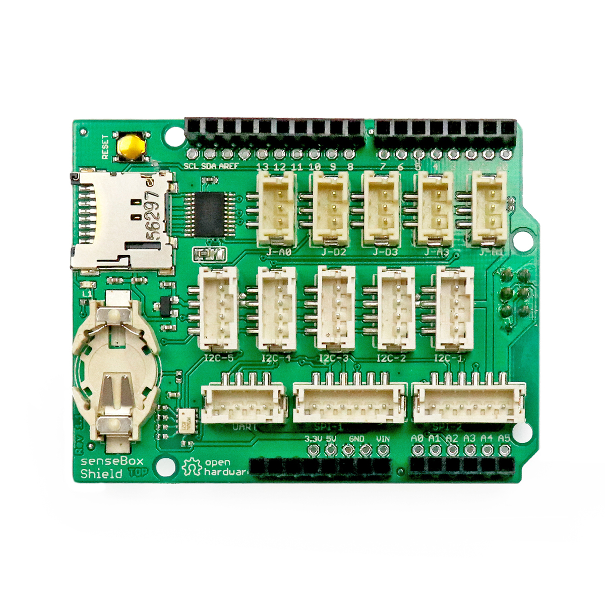

---
title: "SenseBox Shield (Arduino)"
date: "2018-10-01T15:02:45.000Z"
tags: 
  - "shield"
coverImage: "68_sensebox_shield_arduino.jpg"
material_number: "68"
material_type: "shield"
material_short_descr: "SenseBox – Home Shield"
manufacture: "Reedu GmbH & Co. KG"
manufacture_url: "https://sensebox.de/"
repo_name: "mks-SenseBox-Shield"
clone_url: "https://github.com/Make-Your-School/mks-SenseBox-Shield.git"
repo_prefix: "mks"
repo_part: "Shield"
embedded_example_file: "examples/Shield_minimal/Shield_minimal.ino"
---

# SenseBox Shield (Arduino)

## Beschreibung
Produkt vom Markt genommen.

Das SenseBox Shield ist eine Erweiterungsplatine für Arduino-ähnliche Mikrocontroller. Diese Erweiterungsplatinen werden im Allgemeinen als „Shield“ bezeichnet und werden einfach auf den entsprechenden Controller oder Einplatinencomputer gesteckt. Das Shield bietet dann einzelne Steckplätze, um die Sensoren mit entsprechenden Verbindungskabel anzuschließen.

Diese spezielle Ausführung gehört zu der SenseBox. Diese ist ein Citizen Science DIY-Toolkit für die ortsbezogene Messung von Umweltdaten wie Temperatur, Luftfeuchte, Luftdruck, Beleuchtungsstärke und UV-Licht. Dieser Baukasten ermöglicht es, mithilfe von vorausgewählten Sensoren und Online-Anleitungen, eine Wetterstation aufzubauen. Das System kann einfach in die SenseBox-eigene Sensorweb-Plattform (openSenseMap) integriert werden, auf/in der die Umweltdaten kontinuierlich und live im Internet angezeigt werden können. Die Sensoren können alle zusammen mit dem SenseBox Shield an einem beliebigen Arduino angeschlossen werden. Entsprechende vorgefertigte Programme können ebenfalls von der offiziellen Webseite heruntergeladen werden.

Die SenseBox hat mehrere Schritt-für-Schritt-Anleitungen für den Bau der eigenen Wetterstation. Die sonstige Dokumentation ist recht ausführlich, da das gesamte Projekt auch unter der Open-Hardware-Lizenz läuft.

<!-- infolist -->
## Weiterführende Hintergrundinformationen:

- [DIY - Wikipedia Artikel](https://de.wikipedia.org/wiki/Do_it_yourself)
- [Mikrocontroller - Wikipedia Artikel](https://de.wikipedia.org/wiki/Mikrocontroller)

## Wichtige Links für die ersten Schritte:

- [SenseBox Webseite](https://sensebox.de/)
- [Tutorials-SenseBox Home](https://home.books.sensebox.de/de/)
- [Tutorials-SenseBox Edu](https://edu.books.sensebox.de/de/)
- [openSenseMap](https://osem.books.sensebox.de/de/)

